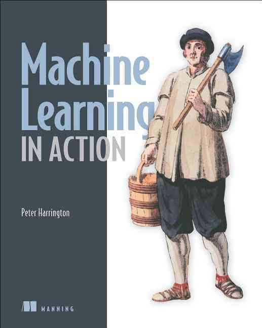

<p align = "center">  </p>

# 机器学习实战笔记(附:[源代码][src] 基于 **[GNU3.0][license]** 协议 
附： [版本号][version] [作者][author]

## 第一部分 分类

### 第一章 机器学习基础([代码][ch01])

- **熟悉[Python][Python]即可。**

- **开发机器学习应用程序步骤**

    - 收集数据
    
        - 制作网络爬虫从网站上抽取数据、从 RSS 反馈或者 API 中得到数据、设备发送过来的实测数据等.
    
    - 准备输入数据
        
        - 必须确保数据格式符合要求.
    
    - 分析输入数据
        
        - 最简单的方法是用文本编辑器打开数据文件，查看得到的数据是否为空值.
        
        - 还可以进一步浏览数据，分析是否可以识别出模式.
        
        - 数据中是否存在明显的异常值.
        
        - 通过一维、二维、三维展示数据也是不错方法.
    
    - 训练算法
    
    - 测试算法
    
        - 对于监督学习，必须已知用于评估算法的目标变量值.
        
        - 对于无监督学习，也必须用其他的评测手段来检验算法的成功率.
        
        - 如果不满意算法的输出结果，可以回到第 4 步，改正并加以测试.
        
        - 问题常常会跟数据的收集和准备有关，这是必须调回到第 1 步重新开始.
    
    - 使用算法
    
        - 将机器学习算法转换成应用程序，执行实际任务，以检验以上步骤是否可以实际环境中正常工作。此时如果碰到新的数据问题，同样需要重复执行上述的步骤.
   
- **掌握[numpy][numpy]函数库基础**

    `>> from numpy import *`

### 第二章 K-近邻算法([代码][ch02])

- **K-近邻算法优缺点**

    -. 优点:精度高,对异常值步敏感，无数据输入假定。
    
    - 缺点:计算复杂度高，空间复杂度高。
    
    - 范围:数值型和标称型。
      
- **测试分类器**

    **`错误率是常用的评估方法，完美评估器为0，最差的评估器为1.0`**
   
- **k-近邻算法的一般流程**

    - 收集数据：可以使用任何方法；
    
    - 准备数据：距离计算所需要的数值，最好是结构化的数据格式；
    
    - 分析数据：可以使用任何方法；
    
    - 训练算法：此步骤不适用于 k-近邻算法；
    
    - 测试算法：计算错误率；
    
    - 使用算法：首先需要输入样本数据和结构化的输出结果，然后运行 k-近邻算法判定输入数据分别属于哪个分类，最后应用对计算出的分类执行后续的处理。

- **例子:使用k-近邻算法改进约会网站的配对效果**

    - 准备数据:从文本数据中解析出数据，用`numpy`转化文本为矩阵，同时进行归一化数值操作(将对数据有影响的数值归纳为`0～1`之间)。

    - 分析数据:使用`matplotlib`实现数据可视化。

    - 测试数据:错误评估 **`训练数据/测试数据 = 90%/10%`**。

    - 使用算法:基于用户的输入，自动匹配。

- **例子:手写识别系统**

    - 准备数据:将图像分为`32*32`的二进制图像转化为`1*1024`的数组，每次读取`32`行,存入数组，并且返回数组。

    - 分析数据:确保数据准确无误。

    - 测试数据:随机选取数据测试。

    - 使用数据:将评估错误率，选择`最低评估错误率`来作为首选算法。

- **小节**

    **K-近邻算法是最简单的分类算法，如果数据量太大，会变得非常耗时。**

### 第三章 决策树([代码][ch03])

- **决策树算法优缺点**

    - 优点:计算复杂度不高，输出结果易于理解，对中间值不明干，可以处理不相关特征数据。
    
    - 缺点:可能会产生过度匹配。
    
    - 范围:数值型和标称型。
    
- **决策树的一般流程**

    - 收集数据
    
    - 准备数据：树构造算法只适用于标称型数据，因此数值型数据必须离散化
    
    - 分析数据：可以使用任何方法，构造树完成之后，应该检查图形是否符合预期
    
    - 训练算法：使用经验树计算错误率
    
    - 使用算法：此步骤可以适用于任何监督学习算法，而使用决策树可以更好地理解数据的内在含义

- **信息增益**

    - 原则: 将无序的数据变得更加有序。
    
    - 在划分数据集之前之后信息发生的变化
    
    - 熵: 信息的期望值，或者集合信息的度量方式。
    
- **熵**

    - 若数据都为一类，那么`H=-1*log2(1)=0，`不用任何信息就能区分这个数据。
    
    - 如有一枚正反两面硬币，分为正面或者反面的概率都为`0.5, H= -0.5log2(0.5) - 0.5log2(0.5) = 1,` 需要一个单位比特信息区分是否是正面或者反面，也即0或者1。
    
    - 熵，代表信息的混乱度信息。其基本作用就是消除人们对事物的不确定性。一个系统越是有序，信息熵就越低；反之，一个系统越是混乱，信息熵就越高。所以，信息熵也可以说是系统有序化程度的一个度量。
    
    - 具体地可参考《信息论》。

- **划分数据集**

    **将每个特征划分数据集的结果计算一次信息熵，然后判断按照哪个特征划分数据集是最好的划分方式。**

- **递归构建决策树**

    - 工作原理：得到原始数据集，基于最好的属性值划分数据集，第一次划分后，再次划分数据。因此可以递归处理数据集。

    - 递归结束的条件：划分数据集所有属性，或者每个分支下的所有实例都具有相同的分类。

    - 如果数据集已经处理了所有属性，但是类标签依然不是唯一的，此时我们通常采用多数表决的方法决定该叶子节点的分类。

- **测试算法:使用决策树执行分类**

    - 执行分类时，需要使用决策树以及用于决策树的标签向量。
    
    - 测试数据与决策树上的数值，递归执行该过程直到进入叶子节点。
    
    - 最后将测试数据定义为叶子节点所属的属性。
    
- **使用算法:决策树的存储**
    
    **为了节约时间和节省内存消耗，使用了pickle模块序列化对象。**
    
- **例子:使用决策树预测隐形眼睛类型**

    **目标:通过决策树预测患者需要佩戴的隐形眼睛类型。**
    ```python
   import trees
   fr = open('lensens.txt')
   lenses = [inst.strip().split('\t') for inst in fr.readlines()]
   lenseslabels = ['age', 'prescipt', 'astigmatic', 'tearRate']
   lensestree = trees.create_tree(lenses, lenseslabels)    
   lensestree
   treePlotter.create_plot(lensestree)
    ``` 
  
- **小节**

    **这里主要是采用`ID3算法划`分数据集，用递归的方法将数据集转化为决策树，并可用`pickle模块存`储决策树的结构。ID3算法无法处理直接数值型数据，需要将其化为标量型数值。决策树最大的缺点在于`过拟合问题`。在构建树的时候，其能够完全匹配实验数据，但是这并不是我们想要的，为此，可以删掉一些只增加了很少信息的节点，将其并入到其他叶子节点中，或者裁剪一些分支。具体决策树的很多问题也待整理。**

### 第四章 基于概率论的分类方法:朴素贝叶斯([代码][ch04])

- **基于贝叶斯决策理论算法优缺点**

    - 优点:在数据较少的情况下仍然有效。可以处理多类别问题。
    
    - 缺点:对于输入数据的准备方式较为敏感。
    
    - 范围:标称型数据。
    
- **Tip:贝叶斯决策理论的核心思想是选择高概率对应的类别，即选择具有最高概率的决策**

- **贝叶斯法则**

    **后验概率 = 标准似然度 * 先验概率。**

- **贝叶斯定理**

    - 对于变量有二个以上的情况，贝叶斯定理亦成立。例如：
    
        - P(A|B,C)=P(B|A)*P(A)*P(C|A,B)/(P(B)*P(C|B))
        
        - 这个式子可以由套用多次二个变量的贝叶斯定理及条件机率的定义导出。
        
- **使用Python进行文本分类**

    - 背景
    
        **以在线社区的留言板为例。为了不影响社区的发展，我们要屏蔽侮厚性的言论，所以要构建一个快速过滤器，如果某条留言使用了负面或者侮辱性的语言，那么就将该留言标识为内容不当。过滤这类内容是-一个很常见的需求。对此问题建立两个类别:侮厚类和非侮辱类，使用1和0分别表示。**

    - 准备数据:从文本中构建词向量
    
    - 训练算法:从词向量计算概率
    
    - 测试算法:根据现实情况修改分类器
    
        - 贝叶斯概率需要计算多个概率的乘积以获得文档属于某个类别的概率，即计算p(w0|1)p(w1|1)p(w2|1)。如果其中一个概率值为0，那么最后的乘积也为0

        - 第二个问题就是下溢出，这是由于太多过小的数相乘造成的。由于大部分因子都非常小，所以程序会下溢出或者得不到正确的答案。解决办法是对乘积取自然对数这样可以避免下溢出或者浮点数舍入导致的错误。

        - 每个单词的出现与否作为一个特征，被称为词集模型；在词袋模型中，每个单词可以出现多次。
    
    - 准备数据:文档词袋模型

- **例子:使用朴素贝叶斯过滤垃圾邮件**

    - 准备数据:切分文本
    
    - 测试算法:使用朴素贝叶进行交叉验证

- **例子:使用朴素贝叶斯从个人广告中获取区域倾向**

    - 收集数据:导入RSS源
    
    - 分析数据:显示低于相关的用词

    **Tip:这里训练测试的方法是从总的数据集中随机选择数字，将其添加到测试集中，同时将其从训练集中剔除。这种随机选择数据的一部分作为训练集，而剩余部分作为测试集的过程为留存交叉验证（hold-out cross validation）。有时为了更精确地估计分类器的错误率，就应该进行多次迭代后求出平均错误率。**

-  **小节**
    
    **贝叶斯可以通过特征之间的独立性假设，降低对数据量的需求。尽管条件独立性的假设并不正确，但是朴素贝叶斯仍然是一种有效的分类器**    

### 第五章 Logistic回归([代码][ch05])

-  **Logistic算法优缺点**

    - 优点:计算代价不高，易于理解和实现。
    
    - 缺点:容易欠似合，分类的精度不高。
    
    - 范围:数值型和标量型数据。
    
-  **基于Logistic回归和Sigmoid函数**
    
    - Sigmoid函数是单位阶越函数。
    
    - 在数学上比较容易处理。
    
    - 在数据量比较大的时候，跨度大；数据量小的时候，跨度平稳。
    
-  **基于最优化方法的最佳回归系数确定**
    
    - 梯度上升法和梯度下降法
        
        - 伪代码
        
            - 每个回归系数初始化为1
        
            - 重复 R 次：
        
            - 计算整个数据集的梯度
        
            - 使用 alpha * gradient 更新回归系数的向量
            - 返回回归系数
    
        - 找到函数的最大值和函数的最小值。
    
        - 一直执行某个迭代的公式，达到某个可以允许误差的范围内。
    
    - 训练算法:找到最佳参数
        
    - 分析数据:画出决策边界
    
    - 训练算法:随机梯度提升
            
        **一次仅用一个样本点来更新回归系数。由于可以在新样本到来时对分类器进行增量式更新，因此也是一个在线学习算法.**
    
        - 伪代码
            
             - 所有回归系数初始化为1
             
             - 对数据集中每个样本
             
             - 计算该样本的梯度
             
             - 使用 alpha*gradient 更新回归系数值
             
             - 返回回归系数值
            
-  **例子:预测病马的死亡率**

    - 收集数据：给定数据文件。
    
    - 准备数据：用 python 解析文本文件并填充缺失值。
    
    - 分析数据：可视化并观察数据。
    
    - 训练算法：使用优化算法，找到最佳的系数。
    
    - 测试算法：为了量化回归的效果，需要观察错误率。根据错误率决定是否回退到训练阶段，通过改变迭代的次数和步长等参数得到更好的回归系数。
    
    - 使用算法：实现一个简单的命令行程序来收集马的症状并输出预测结果。
    
    **注意：除了部分指标主观和难以测量外，该数据还存在一个问题，数据集中有 30% 的值是缺失的。**
    
    - 处理数据中的缺失值:
        
        - 使用可用特征的均值来填补缺失值。
        
        - 使用特殊值来填补缺失值，如 -1。
        
        - 忽略缺失值的样本。
        
        - 使用相似样本的均值填补缺失值。
        
        - 使用另外的机器学习算法预测缺失值。
    
    - 测试算法:用Logistic回归进行分类。
    
- **小节**

    **在最优化算法中，最常用的就是随机梯度上升算法，二梯度上升算法可以简化为随机梯度上身算法。**
    **随机梯度上身算法与梯度上升算法相当，但占用更少的资源。**
    **随机梯度上升算法是一个在线算法，他可以在新数据刚加入的时候就完成参数更新**
    
### 第六章 支持向量机([代码][ch06])

-  **SVM算法优缺点**

    - 优点:泛化错误率低，计算开销不大，结果易解释。
    
    - 缺点:对参数调节和和核函数的选择敏感，原始分类器不加修改仅适用于处理二分类问题。
    
    - 范围:数值型和标称型数据。
    
- **SVM分类(Tip:不讲非线性支持向量机)**

    - 线性支持向量机
    
        - 求解线性支持向量机的过程是凸二次规划问题，所谓凸二次规划问题，就是目标函数是凸的二次可微函数，约束函数为仿射函数`（满足f(x)=a*x+b,a,x均为n为向量）`。而我们说求解凸二次规划问题可以利用对偶算法--即引入拉格朗日算子，利用拉格朗日对偶性将原始问题的最优解问题转化为拉格朗日对偶问题，这样就将求w*，b的原始问题的极小问题转化为求alpha*（alpha>=0）的对偶问题的极大问题，即求出alpha*，在通过KKT条件求出对应的参数w*，b，从而找到这样的间隔最大化超平面，进而利用该平面完成样本分类

    - 近似线性支持向量机

　　     - 当数据集并不是严格线性可分时，即满足绝不部分样本点是线性可分，存在极少部分异常点；这里也就是说存在部分样本不能满足约束条件，此时我们可以引入松弛因子，这样这些样本点到超平面的函数距离加上松弛因子，就能保证被超平面分隔开来；当然，添加了松弛因子sigma，我们也会添加对应的代价项，使得alpha满足0=<alpha<=C
    
- **SMO算法**

    - SMO是一种用于训练SVM的强大算法，它将大的优化问题分解为多个小的优化问题来进行求解。而这些小优化问题往往很容易求解，并且对它们进行顺序求解和对整体求解结果是一致的。在结果一致的情况下，显然SMO算法的求解时间要短很多，这样当数据集容量很大时，SMO就是一致十分高效的算法

    - SMO算法的目标是找到一系列alpha和b，而求出这些alpha，我们就能求出权重w，这样就能得到分隔超平面，从而完成分类任务

    - SMO算法的工作原理是：每次循环中选择两个alpha进行优化处理。一旦找到一对合适的alpha，那么就增大其中一个而减少另外一个。这里的"合适",意味着在选择alpha对时必须满足一定的条件，条件之一是这两个alpha不满足最优化问题的kkt条件，另外一个条件是这两个alpha还没有进行区间化处理

    - 对于SMO算法编写，我们采用由简单到复杂的方法，层层递进，完成最终的SMO算法实现，最后通过实际的用例对SVM模型进行训练，并验证准确性

    - 简化版SMO算法
    
        **简化版SMO算法，省略了确定要优化的最佳alpha对的步骤，而是首先在数据集上进行遍历每一个alpha，再在剩余的数据集中找到另外一个alpha，构成要优化的alpha对，同时对其进行优化，这里的同时是要确保公式：Σαi*label(i)=0。所以改变一个alpha显然会导致等式失效，所以这里需要同时改变两个alpha。**

- **核函数**

    **核函数的目的主要是为了解决非线性分类问题，通过核技巧将低维的非线性特征转化为高维的线性特征，从而可以通过线性模型来解决非线性的分类问题。**

- **例子:手写识别**

    **相较于KNN算法，尽管KNN也能取得不错的效果；但是从节省内存的角度出发，显然SVM算法更胜一筹，因为其不需要保存真个数据集，而只需要其作用的支持向量点，而取得不错的分类效果**

|内核模式,设置 |训练错误率(%) |测试错误率(%) |支持向量数 |
|:-------|:-----------|:-----------|:-------------|
|rbf,0.1|0|52|402|
|rbf,5|0|3.2|402|
|rbf,10|0|0.5|99|
|rbf,50|0.2|2.2|41|
|rbf,100|4.5|4.3|26|
|Linear|2.7|2.2|38|

   **由上图可以看出，σ值在取10时取得了最好的分类效果，这也印证了我们上面的叙述。即对于固定的数据集，存在最优的支持向量个数，使得分类错误率最低。支持向量的个数会随着σ值的增大而逐渐减少，但是分类错误率确实一个先降低后升高的过程。即最小的分类错误率并不意味着最少的支持向量个数。**

- **小节**

    **支持向量机是一种分类器，它具有良好的学习能力，并且学到的东西具有很好的拓展性，SMO解决了SVM训练速度慢的原因。**
    
    **核函数会将数据从一个低维空间映射到一个高维空间，可以将一个在低维空间中的非线性问题转化成为高维空间下的线性问题来求解**
    
    **支持向量机在解决多类问题的时候，需要额外的方法来对其进行扩展，SVM效果也对优化参数和所用核参数中的参数敏感。**
        

### 第七章 利用AdaBoost元算法提高分类性能([代码][ch07])

- **AdaBoost算法的优缺点**

    - 优点： 泛化错误率低，易编码，可以应用再大部分分类器上，无参数调整。
    
    - 缺点： 对离群点敏感。

    - 使用数据类型： 数值型和标称型数据。

- **bagging:基于数据随机重抽样的分类器构造方法**

    **在原始数据选择S次后得到S个数据集的一种技术。新数据集和原数据集的大小相等。每个数据集通过原始样本中随机替换得到的。**

- **boosting**

    - 收集数据:可以使用任意方法。
    
    - 准备数据:依赖于所使用的弱分类器类型,本章使用的是单层决策树,这种分类器可以处理任何数据类型。当然也可以使用任意分类器作为弱分类器,第2章到第6章中的任一分类器都可以充当弱分类器。作为弱分类器,简单分类器的效果更好。

    - 分析数据:可以使用任意方法。

    - 训练算法: Adaboost的大部分时间都用在训练上,分类器将多次在同一数据集上训练弱分类器。

    - 测试算法:计算分类的错误率。
    
    - 使用算法:同SVM一样, Adaboost预测两个类别中的一个。如果想把它应用到多个类次后别的场合,那么就要像多类SVM中的做法一样对。

- 训练算法:基于错误提升分类器的性能
    
    **AbaBoost算法会不断得重复训练和调整权重的过程，直到悬链错误率为0或者弱分类器的数目达到用户的制定值为止。**

- **基于单层决策树构建弱分类器**

    - 伪代码
    
        - 将minError设置为无穷大

        - 对数据集中的每一个属性

        - 对每个步长（第二层循环）：

        - 对每个不等号：

        - 建立一棵单层决策树并利用加权数据集对其进行测试

        - 如果错误率低于minError，则将当前的决策树设为最佳单层决策树

        - 返回最佳单层决策树

- **根据公式构建Adaboost**

    - 伪代码

        - 对每次迭代：

        - 利用buildStump找到最佳的单层决策树

        - 将最佳单层决策树加入数组

        - 计算分类器系数alpha

        - 计算新的权重D

        - 更新累计类别估计值

        - 如果错误率为0.0，跳出循环
    
- **例子:在一个难数据集上应用AdaBoost**    
    
    - 收集数据:提供的文本文件。
    
    - 准备数据:确保类别标签是+1和-1而非1和0。

    - 分析数据:手工检查数据。

    - 训练算法:在数据上,利用adaboosttrainds()画教训练出一系列的分类器。

    - 测试算法:我们拥有两个数据集。在不采用随机抽样的方法下,我们就会对 Adaboost和 Logistic回归的结果进行完全对等的比较。

    - 使用算法:观察该例子上的错误率。不过,也可以构建一个Web网站,让驯马师输入马的症状然后预测马是否会死去。
    
|分类器数目|测试错误率(%)|训练错误率(%)
|:-------|:-----|:--------
|1|0.28|0.27
|10|0.23|0.24
|50|0.19|0.21
|100|0.19|0.22
|500|0.16|0.25
|1000|0.14|0.31
|10000|0.11|0.33

   **不同的弱分类器数目情况下的AdaBoost测试和分类错误率。该数据集是个难数据集。通常情况下，AdaBoost会达到一个稳定的测试错误率，而不会随分类器数目的增多而提高**
   
- **非均衡分类问题**

    - 其他分类性能度量指标
    
        - 正确率
        
        - 召回率
        
        - ROC曲线
        
- **基于代价函数的分类器决策控制**

    **除调节分类器的阈值外，代价敏感的学习（cost-sensitive learning）也可用于处理非均衡分类。引入代价信息的方法，在AdaBoost中，可基于代价函数来调整错误权重向量D；在朴素贝叶斯中，可选择具有最小期望代价而不是最大概率的类别作为最后的结果；在SVM中，可在代价函数中对于不同的类别选择不同的参数C。这些做法会给较小类更多的权重，即在训练时，小类当中只允许更少的错误。**
 
- **处理非均衡问题的数据抽样方法**

    **就是对分类器的训练数据进行改造。可通过欠抽样（undersampling）和过抽样（oversampling）来实现。过抽样意味着复制样例，或者加入与已有样例相似的点（加入已有数据点的插值点，可能导致过拟合问题）。欠抽样意味着删除样例，此方法的缺点在于确定哪些样例需要进行剔除，在选择剔除的样例中可能携带了剩余样例中并不包含的有价值信息。一种解决方法，选择那些离决策边界较远的样例进行删除。** 
 
- **小节**

    **多个分类器组合可能会进一步凸显单个分类器的不足，如过拟合问题。若多个分类器间差别显著，可能会缓解这一问题。差别可以是算法本身或者应用于算法上的数据的不同。**

    **针对错误的调节能力是AdaBoost的长处，AdaBoost函数可以应用于任意能够处理加权数据的分类器。AdaBoost算法十分强大，它能够快速处理其他分类器难以处理的数据集。**

## 第二部分 利用回归预测数值型数据

### 第八章 预测数值型数据:回归([代码][ch08])
   
- **线性回归算法的优缺点**

	- 优点:结果容易理解,计算上下不复杂
	
	- 缺点:对非线性问题数据处理不好.

	- 使用数据类型:数值型和标称型数据.   
   
- **回归方程** 

	**回归方程（regression equation），回归系数（regression weights），求回归系数的过程就是回归。说到回归，一般都是指线性回归（linear regression），还存在非线性回归模型。**  
	
- **局部加权线性回归**

	**线性回归会出现欠拟合现象，因为它求的是最小均方误差的无偏估计。可以在估计中引入一些偏差，从而降低预测的均方误差。其中一个方法是局部加权线性回归（Locally Weighted Linear Regression，LWLR），该算法中给待测点附近的每个点赋予一定的权重，然后在这个子集上基于最小均方差来进行普通的回归。与kNN一样，此算法每次预测均需事先选取出对应的数据子集**


- **缩减系数“理解”数据**

	**若数据的特征比样本点还多，在计算(XTX)−1的时候会出错，也就是输入数据的矩阵X不是满秩矩阵，非满秩矩阵在求逆是会出现问题。接下来介绍两种方法来解决这个问题：岭回归（ridge regression）与前向逐步回归（Forward stepwise regression），其中前向逐步回归与lasso法效果差不多。**
	
- **lasso**

	**是一种压缩估计。它通过构造一个惩罚函数得到一个较为精炼的模型，使得它压缩一些系数，同时设定一些系数为零。因此保留了子集收缩的优点，是一种处理具有复共线性数据的有偏估计。**
	
- **前向逐步回归**

	- 前向逐步回归算法与lasso效果差不多，属于贪心算法，即每一步都尽可能减少误差。一开始，所有的权重都设为1，然后每步所做的决策是对某个权重增加或减少一个很小的值。
	
	- 逐步线性回归算法的优点在于他可以帮助人们理解现有模型并作出改进。当构建一个模型后，可运行该算法找出重要特征，这样就可以及时停止那些不重要特征的收集。最后，如果用于测试，该算法每100次迭代后就可以构建一个模型，可使用类似于10折交叉验证的方法比较这些模型，最终选择使误差最小的模型。
	
	- 当应用缩减方法（逐步线性回归或岭回归）时，模型也就增加了偏差（bias），与此同时却减小了模型的方差。

- **权衡偏差与误差**

	**模型和测量值之间存在的差异，叫做误差。当考虑模型中的“噪声”或者说误差时，必须考虑其来源。**

	- 对复杂的过程简化，会导致模型和测量值之间出现“噪声”和误差。
	
	- 无法理解数据的真实生成过程，也会导致差异的发生。
	
	- 测量过程本身也可能产生“噪声”或问题。

- **小节**

	**与分类一样,回归也是预测目标值的过程**
	**当数据的样本数比特征树还少的时候,矩阵的逆不能直接计算**
	**岭回归是缩减法的一种,相当于回归系数的大小施加了限制**
	**缩减法还可以看作是一个对模型增加偏差的同时减少方差**
	
### 第九章 树回归([代码][ch09])

- **树回归算法的优缺点**

    - 优点:可以对复杂和非线性的问题建模.
    
    - 缺点:结果不容易理解.
    
    - 适用数据类型:数值型和标称型.
    
- **树回归和分类树的思路类似，且方法如下**

    - **收集数据**
    
        - 采用任意方法收集数据.
    
    - **准备数据**
    
        - 需要数值型的数据，标称型数据应该映射成为二值型数据.
    
    - **分析数据**
    
        - 汇出数据的二维可视化显示结果，以字典方式生成树
        
    - **训练算法**
    
        - 大部分时间都花费在叶节点树模型的构建上.
        
    - **测试算法**
    
        - 使用测试数据上的R*R值来分析模型的效果.
    
    - **使用算法**
        
        - 使用训练出的树做预测，预测结果还可以来做很多事情.
    
- **连续和离散型特征的树的构建**
    
    - **在树的构建过程中，需要使用到字典，该字典包含以下4个元素**
    
        - 带切分的特征
        
        - 待切分的特征值
        
        - 右子树
        
        - 左子树

    - **构建树的伪代码**
    
        - 找到最佳的待切分特征
        
        - 如果该节点不能再分，将该节点存为叶节点
        
        - 执行二元切分
        
        - 在右子树调用方法
        
        - 在左子树调用方法

- **将CART算法用于回归**
 
    - **在构建树种新增伪代码**
     
        - 对每个特征

        - 对每个特征值
        
        - 将数据切成两份
        
        - 计算切分的误差
        
        - 如果当前误差小于当前最小误差，那么将切分设定为最佳切分并且更新最小误差
        
- **树剪枝**
    
    **一棵树如果节点过多，就会出现“过拟合”**
    **通过降低决策树的复杂度来避免过拟合的过程称为剪枝**

    - **预剪枝方法**
        
        - 定义一个高度，当决策树达到该高度的时候就停止决策树的增长
        
        - 达到某个节点的实例具有相同的特征向量，即使这些实例不属于同一类，也可以停止决策树的生长，这个方法对处理数据冲突的时候比较有效
        
        - 定义一个阀值，当某个节点树小于阀值的时候就可以停止
        
        - 定义一个阀值，通过计算每次扩张对系统性能的增益，并比较增益值与该阀值大小来决定是否停止决策树的增长
        
    - **后剪枝方法**
    
        - REP(错误率降低剪枝)
        
            - 删除以此节点为根的子树
            
            - 使其成为叶子节点
            
            - 赋予该节点关联的训练数据的最常见分类
            
            - 当修剪后的树对于验证集合的性能不会比原来的树差时，才真正删除该节点
        
        - PEP(悲观错误剪枝)
        
            - 根据剪枝前后错误率来判定子树的修剪。弥补了REP种的缺陷，在评价子树的训练错误公式中添加了一个常数，假定每个叶子节点都动自动对实例的某个部分进行错误的分类
            
            - 缺陷
                
                - PEP算法使用的从上往下的剪枝策略，会导致剪枝过度
                
                - 会出现剪枝失败的情况
        
        - CCP(代价复杂度剪枝)
        
            - 根据真实的误差估计选择最佳决策树
        
        - EBP(基于错误剪枝)
            
            - 计算叶节点的错分类样本率估计的置信区上线为U
            
            - 计算叶节点的预测分类样本数
            
            - 判断是否剪枝以及如何剪枝
        
**以下是集中剪枝的方法比较**

||REP|PEP|CCP|
|:---|:---|:---|:---|
|剪枝方式|自底向上|自顶向下|自底向上|
|计算复杂度|o(n)|o(n)|o(n)*o(n)|
|误差估计|剪枝集上误差估计|使用连续纠正|标准误差|

- **小节**

    **CART算法可以用于构建二元树并处理离散型和连续型的切分，该算法构建出的树会倾向于对数据过拟合。**
	
## 第三部分 无监督学习

### 第10章 K-均值聚类算法([代码][ch10])

- **K-均值算法的优缺点**

    **K-均值是发现给定数据集的 K 个簇的聚类算法, 之所以称之为 `K-均值` 是因为它可以发现 K 个不同的簇, 且每个簇的中心采用簇中所含值的均值计算而成.**
    
    **簇个数 K 是用户指定的, 每一个簇通过其质心（centroid）, 即簇中所有点的中心来描述.** 
   
    **聚类与分类算法的最大区别在于, 分类的目标类别已知, 而聚类的目标类别是未知的.**
    
    - 优点:容易实现

    - 缺点:可能收敛到局部最小值，在大规模数据集上收敛较慢

    - 使用数据类型 : 数值型数据

- **K-均值聚类算法**

    - **伪代码**
    
        - 创建 k 个点作为起始质心（通常是随机选择）
        
        - 当任意一个点的簇分配结果发生改变时（不改变时算法结束）
        
        - 对数据集中的每个数据点
        
        - 对每个质心
        
        - 计算质心与数据点之间的距离
        
        - 将数据点分配到距其最近的簇
        
        - 对每一个簇, 计算簇中所有点的均值并将均值作为质心

    - **开发流程**

        - 收集数据：使用任意方法
        
        - 准备数据：需要数值型数据类计算距离, 也可以将标称型数据映射为二值型数据再用于距离计算
        
        - 分析数据：使用任意方法
        
        - 训练算法：不适用于无监督学习，即无监督学习不需要训练步骤
        
        - 测试算法：应用聚类算法、观察结果.可以使用量化的误差指标如误差平方和（后面会介绍）来评价算法的结果.
        
        - 使用算法：可以用于所希望的任何应用.通常情况下, 簇质心可以代表整个簇的数据来做出决策.

    - K-均值 的评价标准
    
    	**因为对误差取了平方，因此更加重视那些远离中心的点。一种肯定可以降低SSE值的方法是增加簇的个数，但这违背了聚类的目标。聚类的目标是在保持簇数目不变的情况下提高簇的质量。k-means算法因为手动选取k值和初始化随机质心的缘故，每一次的结果不会完全一样，而且由于手动选取k值，我们需要知道我们选取的k值是否合理，聚类效果好不好，那么如何来评价某一次的聚类效果呢？也许将它们画在图上直接观察是最好的办法，但现实是，我们的数据不会仅仅只有两个特征，一般来说都有十几个特征，而观察十几维的空间对我们来说是一个无法完成的任务。因此，我们需要一个公式来帮助我们判断聚类的性能，这个公式就是SSE (Sum of Squared Error, 误差平方和 ），它其实就是每一个点到其簇内质心的距离的平方值的总和，这个数值对应kmeans函数中clusterAssment矩阵的第一列之和。 SSE值越小表示数据点越接近于它们的质心，聚类效果也越好。**


- 使用后处理来提高聚类性能

    - 二分 K-Means 聚类算法
    
    **该算法首先将所有点作为一个簇，然后将该簇一分为二，之后选择其中一个簇继续进行划分，选择哪一个簇进行划分取决于对其划分时候可以最大程度降低 SSE（平方和误差）的值上述基于 SSE 的划分过程不断重复，直到得到用户指定的簇数目为止** 

    - 伪代码
    
    - 将所有点看成一个簇
    
    - 当簇数目小于 k 时
    
    - 对于每一个簇
    
    - 计算总误差
    
    - 在给定的簇上面进行 KMeans 聚类（k=2）
    
    - 计算将该簇一分为二之后的总误差

    - 选择使得误差最小的那个簇进行划分操作

- **小节**

    **聚类算法是一种无监督学习算法.所谓无监督学习是指事先并不知道寻找的内容,即没有目标变量,一种广泛使用的聚类算法是K-均值算法,其中k是用户制定的要创建的族的数目,二分K-均值的聚类算法效果要好于K-均值算法** 

### 第11章 使用Apriori算法进行关联分析([代码][ch11])

- **关联分析**
 
	- 关联分析是一种在大规模数据集中寻找有趣关系的任务。这些关系可以有两种形式: 
	
		- 频繁项集（frequent item sets）: 经常出现在一块的物品的集合。
	
		- 关联规则（associational rules）: 暗示两种物品之间可能存在很强的关系。

|交易号码|商品|
|:---|---|
|0|豆奶草莓|
|1|草莓，尿布，啤酒，辣椒酱|
|2|豆奶，尿布，黄瓜，饼干|
|3|黄瓜，饼干，尿布，啤酒|
|4|黄瓜，啤酒，尿布，黄瓜|

频繁项集指的就是那些经常一起出现的物品集合，比如{啤酒，尿布，饼干}就是频繁项集中的一个例子，而根据上表也可以找到尿布->啤酒这样的关联规则。而我们是要通过关联分析大规模数据从而发现数据之间存在的有趣关系，那么问题来了，什么样的关系是有趣的呢？而这个有趣又是怎么定义的呢？我们可以通过支持度（support）和可信度（置信度confidence）来定义。一个项集的支持度指的是数据集中包含该项集记录所占的比例，上例中{豆奶}的支持度是2/5,{啤酒，尿布}的支持度是3/5；可信度是针对于像{尿布}->{啤酒}这样的关联规则来定义的，定义为：支持度({尿布，葡萄酒})/支持度（尿布）.

- **Apriori 原理**

	- **Apriori算法优缺点**

		- 优点：易编码实现
		
		- 缺点：在大数据集上可能较慢
		
		- 适用数据类型：数值型 或者 标称型数据。

	- **Apriori 算法流程步骤**

		- 收集数据：使用任意方法
	
		- 准备数据：任何数据类型都可以，因为我们只保存集合
		
		- 分析数据：使用任意方法
		
		- 训练数据：使用Apiori算法来找到频繁项集
		
		- 测试算法：不需要测试过程
		
		- 使用算法：用于发现频繁项集以及物品之间的关联规则


- **使用Apriori算法来发现频繁集**

	- Apriori 算法的两个输入参数分别是最小支持度和数据集
	
	- 该算法首先会生成所有单个物品的项集列表
	
	- 接着扫描交易记录来查看哪些项集满足最小支持度要求，那些不满足最小支持度要求的集合会被去掉
	
	- 燃尽后对生下来的集合进行组合以声场包含两个元素的项集
	
	- 接下来再重新扫描交易记录，去掉不满足最小支持度的项集

	- 该过程重复进行直到所有项集被去掉

	- **生成候选项集**

		- **数据集扫描伪代码**

			- 对数据集中的每条交易记录 tran
			
			- 对每个候选项集 can
    		
    		- 检查一下 can 是否是 tran 的子集: 如果是则增加 can 的计数值
			
			- 对每个候选项集
    		
    		- 如果其支持度不低于最小值，则保留该项集
    		
    		- 返回所有频繁项集列表

- **从频繁项集中挖掘关联规则**

	**频繁项集可以使用Apriori算法寻找，当然下来就是要找出关联规则了。我们知道，假设有一个频繁项集，它们之间就有可能有一条关联规则，即可以表示为："...—>..."，但反过来并不一定成立（其中箭头左边对应的集合为前件，箭头右边对应的集合为后件）。在上一节，我们使用最小支持度来量化频繁项集，对应的，采用可信度来量化关联规则。其中一条规则p—>H的可信度定义为：support(P|H)/support(P)，为找到其中的关联规则，我们可以先生成一个可能的规则列表，然后测试每条规则的可信度，结合可信度的最小要求，得到关联规则。同寻找频繁项集类似，我们可以为每个频繁项集产生许多关联规则，这样就会有很多的关联规则产生。结合Apriori原理，如果某条规则不满足最小可信度要求，那么该规则的所有子集也就不满足最小可信度要求，据此我们可以减少需要测试的规则数目，简化问题。**
	
	- **寻找关联规则的思想**

		- 从一个频繁项集开始，创建一个规则列表，首先将规则的右边限定为一个元素，对这些规则进行测试
		- 合并剩下的规则来创建一个新的规则列表，规则的右边限定为两个元素

- **小节**

    - **关联分析适用于发现发数据之间有趣关系的一个工作集，可以采用两种方式，一种是使用频繁项集，另外一种是使用关联规则**

    - **使用Apriori原理可以有效的减少数据库上进行检查的集合的数目**

### 第12章 使用FP-growth算法来高效发现频繁项集([代码][ch12])

- **FP**

    - **优点**
        
        - 因为 FP-growth 算法只需要对数据集遍历两次，所以速度更快。
        
        - FP树将集合按照支持度降序排序，不同路径如果有相同前缀路径共用存储空间，使得数据得到了压缩。
        
        - 不需要生成候选集。
        
        - 比Apriori更快。
    - **缺点**
    
        - FP-Tree第二次遍历会存储很多中间过程的值，会占用很多内存。
        
        - 构建FP-Tree是比较昂贵的。
    - **适用数据类型**
        
        - 标称型数据(离散型数据)。

    **FP-Tree算法全称是FrequentPattern Tree算法，就是频繁模式树算法，他与Apriori算法一样也是用来挖掘频繁项集的，不过不同的是，FP-Tree算法是Apriori算法的优化处理，他解决了Apriori算法在过程中会产生大量的候选集的问题，而FP-Tree算法则是发现频繁模式而不产生候选集。但是频繁模式挖掘出来后，产生关联规则的步骤还是和Apriori是一样的。**

    - **创建FP树步骤**
    
        - 创建根节点，用NULL标记。

        - 统计所有的事务数据，统计事务中各个类型项的总支持度(在下面的例子中就是各个商品ID的总个数)

        - 依次读取每条事务，比如T1， 1， 2， 5，因为按照总支持度计数数量降序排列，输入的数据顺序就是2， 1， 5，然后挂到根节点上。

        -依次读取后面的事务，并以同样的方式加入的FP树中，顺着根节点路径添加，并更新节点上的支持度计数。

- **Fp树的数据挖掘**
    
    - 由长度为1 的频繁模式开始，构造他的条件模式基（一个“子数据库”，由FP树中与后缀模式一起出现的前缀路径集组成）。

    - 构造该初始后缀模式的条件FP树，并递归的在该树上实现挖掘。模式增长通过后缀模式与条件FP树产生的频繁模式连接实现。

- **Fp树性质**
    
    - (结点链性质)对于任何频繁项ia，从FP-tree的头表对应ia项的头指针(headof node_link)开始，通过遍历ia的结点链(node_link)可以挖掘出所有包含ia的频繁模式。
    
    - (前缀路径性质)为了计算以ia为后缀的频繁模式，仅仅需要在FP-tree中计算ia结点的前缀路径，并且前缀路径中每个结点的频繁计数等于ia结点的频繁计数。
    
    - (分段增长)设α为事务数据库D中的一个项集，B是α的条件模式基，而β是B中的一个项集，那么在D中α∪β的支持度等于B中β的支持度。

    - (模式增长)设项α为事务数据D中的一个项集，B是α的条件模式基，13而β是B中的一个项集，那么α∪β为频繁项集的充分必要条件是β也为频繁项集。

    - (单路径频繁项集产生)如果FP-treeT包含一条单路径P，那么T包含的所有频繁项集的集合可以通过枚举路径P中结点的所有可能组合得到，其支持度计数为组合中结点的支持度计数的最小值。

    - 给定一个事务数据库D,最小支持度阈值minσ和频繁项头表=<……>nLi,i,,i12。挖掘频繁闭项集的问题可以分解为n个子问题：第j(1≤j≤n)个子问题是找到所有包含ijn+1?但不包含i(n1jkn)k+?<≤的频繁闭项集。
可以看出，后挖掘到的频繁闭项集不可能包含先前找到的频繁闭项集，但是它可能被已有的一个频繁闭项集所包含，因此在挖掘过程中要对新挖掘的候选频繁闭项集进行检验。如果刚得到的候选频繁闭项集X不是已有的一个频繁闭项集的子集或者两者的支持度不同，那么就说X通过了FCI超集检测，是一个频繁闭项集。

    - 如果X是一个频繁闭项集，那么在X的条件模式基中不存在任何一个项i出现在每一个事务中。

    - 如果Y是一个最大项集合(Y满足：出现在X的条件模式基的每一个事务中，但Y的直接超集不满足这一性质)，并且X∪Y通过了FCI超集检测，那么X∪Y是一个频繁闭项集。

    - 单路径候选频繁闭项集：设i是X的条件模式基中的一个频繁项目，如果X的条件模式树中只有一个结点N标记为i，并且N的所有祖先结点只有一个子女，N若满足下列三个条件之一：
        
        - N没有子女。

        - N有两个以上的子女。
           
        - N有一个子女，它的支持度计数小于N的。
        
            **那么单路径候选频繁闭项集就是X∪Z，Z包含N和N的祖先(除根结点)。如果条件模式X的条件FP-tree存在单路径，在单路径中提取候选频繁闭项集的个数为单路径中具有不等的频度个数。**

    - 对单路径候选频繁闭项集Y，如果Y通过了FCI超集检测，则Y是一个频繁闭项集。

    - X和Y是两个频繁项集且具有相同的支持度。如果X?Y且Y是闭项集，那么不存在只包含X不包含Y?X的频繁闭项集。

- **小节**

    **FP算法是一种用于发现数据集中频繁模式有效的办法**
    
    **FP树构建完成之后，可以通过查找元素项的条件基于及构建条件FP树来发现频繁项集**
    
    **该过程不断以更多元素作为条件重复执行，直到FP树中只包含了一个元素为止**

## 第四部分 其他工具

### 第13章 利用PCA来简化数据([代码][ch13])

- **降维技术**

    **降维的意思是能够用一组个数为d的向量zi来代表个数为D的向量xi所包含的有用信息，其中d<D。假设对一张512*512大小的图片，用svm来做分类，最直接的做法是将图按照行或者列展开变成长度为512*512的输入向量xi，跟svm的参数相乘。假如能够将512*512的向量在保留有用信息的情况下降维到100，那么存储输入和参数的空间会减少很多，计算向量乘法的时间也会减少很多。所以降维能够有效的减少计算时间。而高维空间的数据很有可能出现分布稀疏的情况，即100个样本在100维空间分布肯定是非常稀疏的，每增加一维所需的样本个数呈指数级增长，这种在高维空间中样本稀疏的问题被称为维数灾难。降维可以缓解这种问题。而为什么可以降维，这是因为数据有冗余，要么是一些没有用的信息，要么是一些重复表达的信息，例如一张512*512的图只有中心100*100的区域内有非0值，剩下的区域就是没有用的信息，又或者一张图是成中心对称的，那么对称的部分信息就重复了。正确降维后的数据一般保留了原始数据的大部分的重要信息，它完全可以替代输入去做一些其他的工作，从而很大程度上可以减少计算量。例如降到二维或者三维来可视化。**

    - 原因
    
        - 使的数据更加简单易用
    
        - 降低很多算法的开销
    
        - 去除噪声
    
        - 使的结果变得非常易懂
    
- **从什么角度出发来降维**

    **一般来说可以从两个角度来考虑做数据降维，一种是直接提取特征子集做特征抽取，例如从512*512图中只取中心部分，一种是通过线性/非线性的方式将原来高维空间变换到一个新的空间，这里主要讨论后面一种。后面一种的角度一般有两种思路来实现，一种是基于从高维空间映射到低维空间的projection方法，其中代表算法就是PCA，而其他的LDA、Autoencoder也算是这种，主要目的就是学习或者算出一个矩阵变换W，用这个矩阵与高维数据相乘得到低维数据。另一种是基于流形学习的方法，流形学习的目的是找到高维空间样本的低维描述，它假设在高维空间中数据会呈现一种有规律的低维流形排列，但是这种规律排列不能直接通过高维空间的欧式距离来衡量，如下左图所示，某两点实际上的距离应该是下右图展开后的距离。如果能够有方法将高维空间中流形描述出来，那么在降维的过程中就能够保留这种空间关系，为了解决这个问题，流形学习假设高维空间的局部区域仍然具有欧式空间的性质，即它们的距离可以通过欧式距离算出(Isomap)，或者某点坐标能够由临近的节点线性组合算出(LLE)，从而可以获得高维空间的一种关系，而这种关系能够在低维空间中保留下来，从而基于这种关系表示来进行降维，因此流形学习可以用来压缩数据、可视化、获取有效的距离矩阵等。**

- **几种降维的方法**

    - PCA
        
        - 优点:降低数据的复杂性，识别最重要的多个特征
        
        - 缺点:不一定需要，且有可能损失信息
        
        - 使用数据类型:数值型数据
        
        - **原理**
        
            - 输入:N个D维向量x1,…,xN，降维到d维
            
            - 输出:投影矩阵W=(w1,…,wd)，其中每一个wi都是D维列向量
            
            - 目标:投影降维后数据尽可能分开，maxwtr(WTXXTW)(这里的迹是因为上面提到的B的非对角线元素都是0，而对角线上的元素恰好都是每一维的方差)
            
            - 假设:降维后数据每一维方差尽可能大，并且每一维都正交

                - 将输入的每一维均值都变为0，去中心化
                
                - 计算输入的协方差矩阵C=X∗XT
                
                - 对协方差矩阵C做特征值分解
                
                - 取最大的前d个特征值对应的特征向量w1,…,wd
- **小节**

    **降维技术使得数据变的更易使用，并且它们往往能够去除数据中的噪音，使得其他机器学习任务更加精确。
降维往往作为预处理步骤，在数据应用到其他算法之前清洗数据。**
    
    - 比较流行的降维技术
    
        - 独立成分分析
        
        - 因子分析
        
        - 主成分分析(应用最广泛)

### 第14章 利用SVD简化数据([代码][ch14])

- **SVD的应用**

    - 图像压缩
    
    - 噪声滤波
    
    - 模式识别
     
    - 生物，物理，经济方面的一些统计模型的处理。

    - **SVD优缺点**
    
         - 优点:简化数据，去除噪声，提高算法的结果
         
         - 缺点:数据的转化可能难以理解
         
         - 适用数据类型:数值型数据
         
    - **推荐系统**
    
        **推荐系统是利用电子商务网站向客户提供商品信息和建议，帮助用户决定应该购买什么产品，模拟销售人员帮助客户完成购买过程。**

        - **案例**
        
            - Amazon 会根据顾客的购买历史向他们推荐物品
            
            - Netflix 会向其用户推荐电影
            
            - 新闻网站会对用户推荐新闻频道
            
- **矩阵分解**

    - **三角分解法 (Triangular Factorization)**
    
        **三角分解法是将原正方 (square) 矩阵分解成一个上三角形矩阵或是排列(permuted) 的上三角形矩阵和一个 下三角形矩阵，这样的分解法又称为LU分解法。它的用途主要在简化一个大矩阵的行列式值的计算过程，求逆矩阵，和求解联立方程组。不过要注意这种分解法所得到的上下三角形矩阵并非唯一，还可找到数个不同 的一对上下三角形矩阵，此两三角形矩阵相乘也会得到原矩阵**
    
    - **QR 分解法 (QR Factorization)**
    
        **QR分解法是将矩阵分解成一个正规正交矩阵与上三角形矩阵,所以称为QR分解法,与此正规正交矩阵的通用符号Q有关**
    
    - **奇异值分解法 (Singular Value Decomposition)**
    
        **奇异值分解 (singular value decomposition,SVD) 是另一种正交矩阵分解法；SVD是最可靠的分解法，但是它比QR 分解法要花上近十倍的计算时间。[U,S,V]=svd(A)，其中U和V分别代表两个正交矩阵，而S代表一对角矩阵。 和QR分解法相同， 原矩阵A不必为正方矩阵。使用SVD分解法的用途是解最小平方误差法和数据压缩**

- **协同过滤引擎**

    - **协同过滤（collaborative filtering）是通过将用户和其他用户的数据进行对比来实现推荐的算法**

    - **相似度计算**
    
        **欧氏距离（euclidean metric）用Python实现相似度计算**
        
        ```python
        import numpy as np
        def eulid_sim(colA, colB):
          return 1.0/(1.0 + np.linalg.norm(colA - colB))
        ```
        
    - **相似度选择**
    
        **计算两个电影之间的距离，是基于物品（item-based）的相似度，计算用户的距离，是基于用户（user-based）的相似度。到底使用哪种相似度，取决于用户和物品的数量。基于物品的相似度会随着物品增加而增加，基于用户的相似度会随着用户的增加而增加。如果用户很多，则倾向于物品相似度计算方法。对于大部分推荐引擎而言，用户数目往往大于物品数目，所以一般用物品相似度**
    
- **小节**

    **由于推荐引擎建好后既没有预测的目标值，也没有用户来调查他们对推荐的满意程度，所以常常将某些已知的评分值去掉，然后对它们进行预测，计算预测值和真实值之间的差异**

    **通常用于推荐引擎评价的指标是最小均方根误差（Root Mean Squared Error，RMSE），先计算均方误差的平均值，在取平方根。如果评级在1～5星级，我们得到的RMSE为1，则和真实评价差了1个星级**

### 第15章 大数据与MapReduce([代码][ch15])

- **MapReduce:分布式计算的框架**

    - **MapRedece**
    
        **分布式的计算框架，可以将单个计算作业分配给多台计算机执行**
        
        - **优缺点**
            
            - 优点: 使程序以并行的方式执行，可在短时间内完成大量工作
            
            - 缺点: 算法必须经过重写，需要对系统工程有一定的理解
            
            - 适用数据类型: 数值型和标称型数据
        
        - **工作原理**
        
            - 主节点控制 MapReduce 的作业流程

            - MapReduce 的作业可以分成map任务和reduce任务
            
            - map 任务之间不做数据交流，reduce 任务也一样
            
            - 在 map 和 reduce 阶段中间，有一个 sort 和 combine 阶段
            
            - 数据被重复存放在不同的机器上，以防止某个机器失效
            
            - mapper 和 reducer 传输的数据形式为 key/value对
        
    - **Hadoop**
        
        - **核心设计**
        
            **HDFS和MapReduce**
            
            - HDFS为海量的数据提供了存储
            
            - MapReduce为海量的数据提供了计算
        
        - **优点**
            
            - 高可靠性。Hadoop按位存储和处理数据的能力值得人们信赖
            
            - 高扩展性。Hadoop是在可用的计算机集簇间分配数据并完成计算任务的，这些集簇可以方便地扩展到数以千计的节点中
            
            - 高效性。Hadoop能够在节点之间动态地移动数据，并保证各个节点的动态平衡，因此处理速度非常快
            
            - 高容错性。Hadoop能够自动保存数据的多个副本，并且能够自动将失败的任务重新分配
            
            - 低成本。与一体机、商用数据仓库以及QlikView、Yonghong Z-Suite等数据集市相比，hadoop是开源的，项目的软件成本因此会大大降低
    
- **MapReduce 机器学习**

    - 简单贝叶斯：它属于为数不多的可以很自然的使用MapReduce的算法。通过统计在某个类别下某特征的概率。

    - k-近邻算法：高维数据下（如文本、图像和视频）流行的近邻查找方法是局部敏感哈希算法。

    - 支持向量机(SVM)：使用随机梯度下降算法求解，如Pegasos算法。

    - 奇异值分解：Lanczos算法是一个有效的求解近似特征值的算法。

    - k-均值聚类：canopy算法初始化k个簇，然后再运行K-均值求解结果。
    
    - **对于面向大数据并行处理的计算模型、框架和平台，MapReduce隐含了以下三层含义**

        - MapReduce是一个基于集群的高性能并行计算平台（Cluster Infrastructure）。它允许用市场上普通的商用服务器构成一个包含数十、数百至数千个节点的分布和并行计算集群

        - MapReduce是一个并行计算与运行软件框架（Software Framework）。它提供了一个庞大但设计精良的并行计算软件框架，能自动完成计算任务的并行化处理，自动划分计算数据和计算任务，在集群节点上自动分配和执行任务以及收集计算结果，将数据分布存储、数据通信、容错处理等并行计算涉及到的很多系统底层的复杂细节交由系统负责处理，大大减少了软件开发人员的负担
        
        - MapReduce是一个并行程序设计模型与方法（Programming Model & Methodology）。它借助于函数式程序设计语言Lisp的设计思想，提供了一种简便的并行程序设计方法，用Map和Reduce两个函数编程实现基本的并行计算任务，提供了抽象的操作和并行编程接口，以简单方便地完成大规模数据的编程和计算处理
    
    - **主要提供的主要功能**
    
        - **数据划分和计算任务调度**
            
            **系统自动将一个作业（Job）待处理的大数据划分为很多个数据块，每个数据块对应于一个计算任务（Task），并自动 调度计算节点来处理相应的数据块。作业和任务调度功能主要负责分配和调度计算节点（Map节点或Reduce节点），同时负责监控这些节点的执行状态，并 负责Map节点执行的同步控制**

        - **数据/代码互定位**
            
            **为了减少数据通信，一个基本原则是本地化数据处理，即一个计算节点尽可能处理其本地磁盘上所分布存储的数据，这实现了代码向 数据的迁移；当无法进行这种本地化数据处理时，再寻找其他可用节点并将数据从网络上传送给该节点（数据向代码迁移），但将尽可能从数据所在的本地机架上寻 找可用节点以减少通信延迟**

        - **系统优化**
            
            **为了减少数据通信开销，中间结果数据进入Reduce节点前会进行一定的合并处理；一个Reduce节点所处理的数据可能会来自多个 Map节点，为了避免Reduce计算阶段发生数据相关性，Map节点输出的中间结果需使用一定的策略进行适当的划分处理，保证相关性数据发送到同一个 Reduce节点；此外，系统还进行一些计算性能优化处理，如对最慢的计算任务采用多备份执行、选最快完成者作为结果**

        - **出错检测和恢复**

            **以低端商用服务器构成的大规模MapReduce计算集群中，节点硬件（主机、磁盘、内存等）出错和软件出错是常态，因此 MapReduce需要能检测并隔离出错节点，并调度分配新的节点接管出错节点的计算任务。同时，系统还将维护数据存储的可靠性，用多备份冗余存储机制提 高数据存储的可靠性，并能及时检测和恢复出错的数据**

- **小节**

    - **当运算需求超出了当前资源的运算能力，可以将计算转化称并行的作业，即转化为MapReduce**
    
    - **一个典型的作业流程是先使用map阶段并行处理数据，之后将这些数据在reduce阶段合并**
    
    - **大多数机器学习算法都很容易能写成MapReduce作业**
           
[src]:https://github.com/lornatang/machine_learning_in_action_py3/tree/master/src

[license]:https://github.com/lornatang/machine_learning_in_action_py3/tree/master/LICENSE

[version]:https://github.com/lornatang/machine_learning_in_action_py3/tree/master/__version__

[author]:https://github.com/lornatang/machine_learning_in_action_py3/tree/master/__author__

[python]:https://www.python.org/

[numpy]:http://www.numpy.org/

[ch01]:https://github.com/Lornatang/machine_learning_in_action_py3/tree/master/src/ch01

[ch02]:https://github.com/Lornatang/machine_learning_in_action_py3/tree/master/src/ch02

[ch03]:https://github.com/Lornatang/machine_learning_in_action_py3/tree/master/src/ch03

[ch04]:https://github.com/Lornatang/machine_learning_in_action_py3/tree/master/src/ch04

[ch05]:https://github.com/Lornatang/machine_learning_in_action_py3/tree/master/src/ch05

[ch06]:https://github.com/Lornatang/machine_learning_in_action_py3/tree/master/src/ch06

[ch07]:https://github.com/Lornatang/machine_learning_in_action_py3/tree/master/src/ch07

[ch08]:https://github.com/Lornatang/machine_learning_in_action_py3/tree/master/src/ch08

[ch09]:https://github.com/Lornatang/machine_learning_in_action_py3/tree/master/src/ch09

[ch10]:https://github.com/Lornatang/machine_learning_in_action_py3/tree/master/src/ch10

[ch11]:https://github.com/Lornatang/machine_learning_in_action_py3/tree/master/src/ch11

[ch12]:https://github.com/Lornatang/machine_learning_in_action_py3/tree/master/src/Ch12

[ch13]:https://github.com/Lornatang/machine_learning_in_action_py3/tree/master/src/Ch13

[ch14]:https://github.com/Lornatang/machine_learning_in_action_py3/tree/master/src/Ch14

[ch15]:https://github.com/Lornatang/machine_learning_in_action_py3/tree/master/src/Ch15
